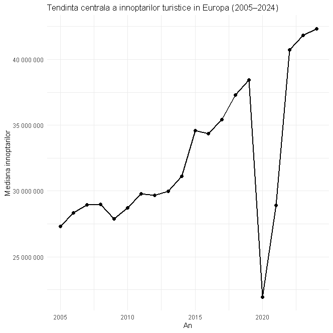
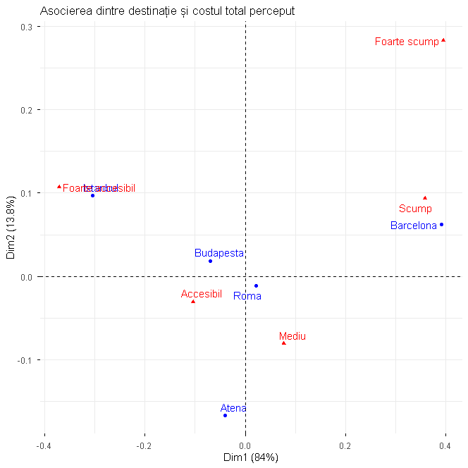
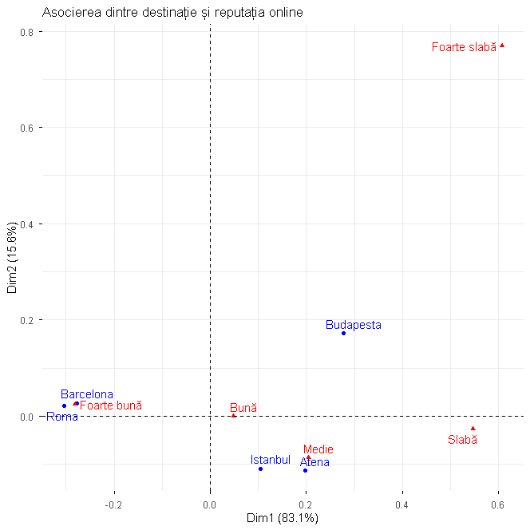

# Vacation Destination Choice Analysis

Bachelor's thesis project examining how consumers choose vacation destinations. The analysis combines European tourism trends, an anonymous survey of 285 respondents, correspondence analysis in R, and an ELECTRE II multicriteria model in Excel.

## Project objectives

- Explore European tourism activity between 2005 and 2024 using Eurostat data.
- Identify associations between respondent profiles, travel behaviour, destination perceptions, and digital information sources.
- Compare Barcelona, Rome, Athens, Istanbul, and Budapest across eight decision criteria.
- Contrast spontaneous destination preferences with a structured multicriteria ranking.

## Tools and methods

- **R:** data preparation, descriptive analysis, chi-square tests, correspondence analysis, and visualisation
- **Excel:** ELECTRE II calculations and multicriteria ranking
- **Packages:** `readxl`, `dplyr`, `tidyr`, `ggplot2`, `FactoMineR`, `factoextra`, `stringr`, `scales`, `forcats`
- **Methods:** fixed-base index (2019 = 100), contingency tables, chi-square tests, correspondence analysis, and ELECTRE II

## Data

- **Eurostat:** nights spent at tourist accommodation establishments, 2005–2024 (`tour_occ_ninat__custom_21545772`), extracted on 20 May 2026.
- **Survey:** 285 anonymous responses covering demographics, travel habits, information sources, destination perceptions, and final preferences.
- **Decision model:** five destinations evaluated against eight criteria: total cost, safety, attractions and experiences, transport accessibility, value for money, accommodation, atmosphere and social life, and online reputation.

The public survey file contains no names, email addresses, or submission timestamps. Exact timestamps were replaced with sequential response IDs.

## Key findings

- European tourism grew through 2019, fell sharply in 2020, and recovered strongly during 2021–2024.
- Income and frequency of international travel were significantly associated (`χ² = 47.98`, `p = 2.56e-05`).
- Barcelona was associated with higher perceived total cost, while Istanbul was perceived as more accessible and stronger on value for money.
- Barcelona and Rome had the strongest online reputation profiles.
- TikTok/Instagram usage differed significantly by age (`χ² = 62.37`, `p = 1.59e-10`) and preferred vacation type (`χ² = 24.61`, `p = 0.0018`).
- The ELECTRE II ranking placed **Rome first**, followed by **Istanbul**, **Barcelona**, and then **Athens and Budapest (tie)**.

## Selected visualisations

### European tourism trend



### Destination and perceived total cost



### Destination and online reputation



## Repository structure

All project files are stored in the repository root for straightforward access. The repository includes the anonymised survey data, Eurostat tourism data, the ELECTRE II workbook, R analysis scripts, generated visualisations, package requirements, and this README.

## How to run

1. Download or clone the repository.
2. Open R or RStudio with the repository root as the working directory.
3. Run `source("requirements.R")` once to install any missing packages.
4. Run any analysis script, for example:

```r
source("correspondence-destination-cost.R")
```

Open `electre-ii.xlsx` to inspect the multicriteria calculations and final ranking.

## Academic context

This project was completed for the BSc in Economic Cybernetics at the Bucharest University of Economic Studies. Generative AI was used for language review and support in clarifying parts of the R code; the analysis decisions, data processing, interpretation, and conclusions were reviewed by the author.
